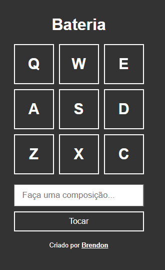

# Bateria

Com esse projeto eu pude aprender mais sobre os eventos de tecla, identificando as teclas e dando ações para cada uma delas utilizando for e também setTimeout.

#

Demonstração (link no final):

Link: https://brendonssilva.github.io/Bateria/